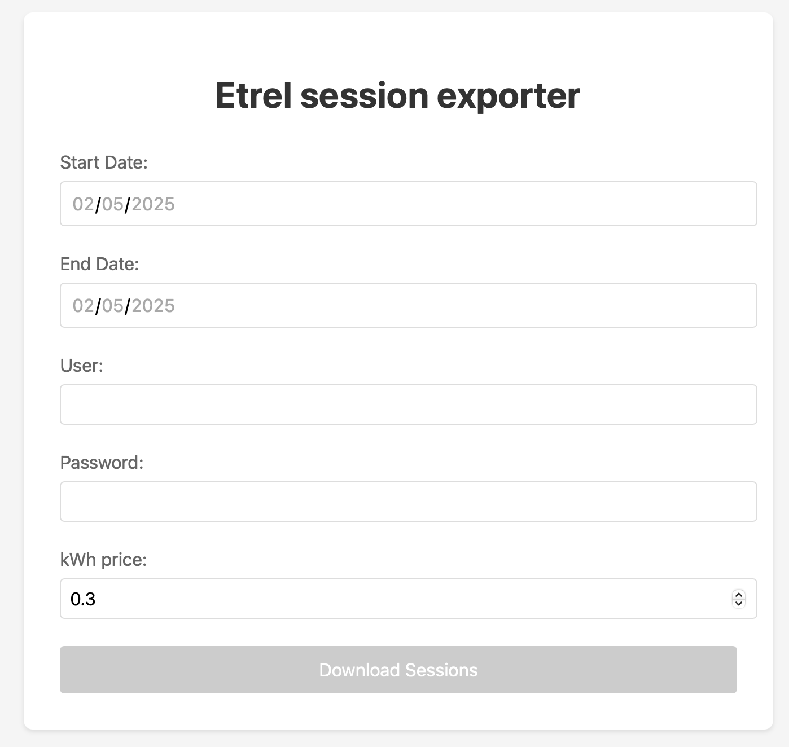

# Etrel Session Exporter

This application allows you to export Etrel INCH charging session data to Excel files based on a date range selection.

## Project Structure
- `frontend/`: Angular frontend application
- `backend/`: Node.js backend server

The frontend will run on http://localhost:8080

## Setup Instructions

### Preparing
In backend/environment.ts change the baseURL to the ip-address/domain of your charging station

### Docker Setup
If you have docker installed you can simply run the application with
   ```bash
   docker compose up -d
   ```

### Backend Setup
1. Navigate to the backend directory:
   ```bash
   cd backend
   ```
2. Install dependencies:
   ```bash
   npm install
   ```
3. Start the server:
   ```bash
   npm start
   ```
The backend will run on http://localhost:3000

### Frontend Setup
1. Navigate to the frontend directory:
   ```bash
   cd frontend
   ```
2. Install dependencies:
   ```bash
   npm install
   ```
3. Start the development server:
   ```bash
   npm start
   ```

## Usage
1. Open the application in your browser at http://localhost:8080
2. Select a start date and end date
3. Enter credentials
4. Click the "Download Sessions" button to get the Excel file


